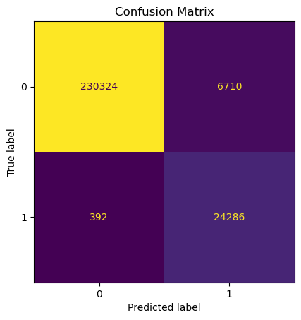
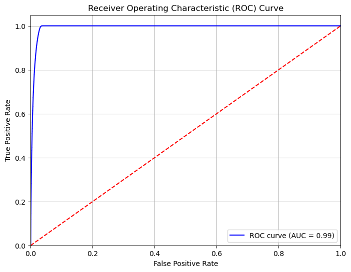

# GST_Hackathon

This repository is for the GST_Hackathon organized by government of India.

The final model that was saved had 4 sections. First the model is initialized then we take the following steps:
   
i. Creating dataset - The training and testing data is built using the `create_dataset()` function wherein we pass the dataframe and it returns the features data that can be used for training and prediction.

ii. Training data - After getting the data we call the `fit()` function that takes the features and target column and trains the model on it.

iii. Prediction - After training we get the prediction using `predict()` function that takes the features data and gives out the final predictions.

iv. Predicting probabilities - Since we want to get the roc_auc score we can call the `predict_proba()` function that uses the same input as `predict()` function and gives out probabilities of the classification results.

``` python
with open('model.pkl', 'rb') as model_file:
    model = pickle.load(model_file)

df = model.create_dataset(df)

y_pred = model.predict(df)
y_pred_proba = model.predict_proba(df)

accuracy = accuracy_score(y['target'], y_pred)*100
precision = precision_score(y['target'], y_pred)
recall = recall_score(y['target'], y_pred)
f1 = f1_score(y['target'], y_pred)
auc_roc = roc_auc_score(y['target'], y_pred_proba[:, 1])

print(f"Accuracy: {accuracy:.4f}")
print(f"Precision: {precision:.4f}")
print(f"Recall: {recall:.4f}")
print(f"F1 Score: {f1:.4f}")
print(f"AUC-ROC: {auc_roc:.4f}")

# Accuracy: 97.2863
# Precision: 0.7835
# Recall: 0.9841
# F1 Score: 0.8724
# AUC-ROC: 0.9930

```




